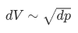

  

# DIY-Beatmungsgerät Mass Air Flow Sensor

The mass air flow sensor has started as part of the "DIY-Beatmungsgerät" project, which itself developed itself from the German hackathon event [#WirvsVirusHackathon](https://wirvsvirushackathon.org/) in March 2020.

The aim of this repository to provide data to use ready-made mass air flow sensors as well as build and verify DIY mass air flow sensors. The current DIY approach is based on analogue differential pressure sensors.

## Hardware setup

The hardware setup consists of replaceable components:

- The sensor controller (e.g. an Arduiono Leonardo) which reads flow values from one or several meters.
- The mass airflow meter, either being
  - a ready-made meter, such as an *Sensirion SFM3000 Low Pressure Drop Digital Flow Meter* or
  - a DIY meter, consisting of a differential pressure sensor + 3D printed tube + hardware to read values from the sensor (e.g. an Arduino Nano) and provide them over a digital interface.

  

The digital interface between sensors/meters and sensor controller is a simple I2C interface, i.e. the signals SCL (serial clock), SDA (serial data) and a common GND is required. The two I2C lines should also have a pull-up resistor. In the setup shown above, the pull-up resistors are pulled up by the controller's VCC of 5 V.

The hardware setup is based on Arduino hardware, but in general other hardware with an I2C interface, a generic I2C library and a C++ compiler can theoretically be used, too.

## DIY mass air flow meter

Our prototype for a DIY mass air flow meter consists of:

1. **a 3D printed tube:**
   Currently two designs are available: the "Grid type" and the "Venturi type"); the model files are available within this repository.

2. **an analog differential pressure sensor:**
   The current prototype uses a NXP MPXV5004DP (for 0 to 3.92 kPa). It's an 8-pin chip but uses only power supply (VCC + GND) and provides a measurement via its analog output V_OUT. The 3D models of the tube are designed to fit the sensor in middle of the tube.

3.  **a microcontroller board** used to sample the analog values and provide them via a compatible digital interface (I2C):
   The prototype is based on an Arduino Nano. 

   
    3D tube outline

   
    Left: "Grid type"; right: "Venturi type"

## DIY mass air flow meter - sensor code

The sensor code is used to:

- Cyclically read the analog input (i.e. sampling).
- Convert the measured voltage which represents the differential pressure to volume flow.
  This contains internal calculation of the volume flow value or mapping via a look-up table.
- Provide the measurement via the I2C digital interface for readout.

Additional features:

- Provide the compatible I2C digital interface for readout of serial number.
- CRC calculation for the data packets to be interface compatible.
- Offset voltage calibration via internal EEPROM at startup.
- Verification of real-time conditions via an additional GPIO pin (for external timing measurements with an oscilloscope or logic analyzer).

The source code can be found [in this subdirectory of this repository](../sensor-software).

It's especially complicated to map the differential pressure to volume flow. Assuming formulas for the "Venturi type" tube, we can estimate a quadratic relation between volume flow and differential pressure:

  

Or:

  

  

However, when the DIY meter is compared with a reference meter, it shows that the constant factor K is around 15.0 and not as calculated around 6.7. This may be due to non-linearities, but the reason is currently not known for sure.

The MATLAB/Octave script can be found [here inside our repository](../sensor-software/VenturiCalcFlow.m).

## Mass air flow meter - controller code

The sensor code is used to:

- Manage one or several sensor instances with different I2C addresses.
- Set the sensors into measuring mode.
- Cyclically read flow meter values from the I2C bus and convert them to floating point values in standard liters per minute.
- Provide the data via serial output (or other interface, e.g. store them in a data lake, etc.), so that they can be plotted/displayed or used by another higher-level component or implementation to control/monitor a ventilator.
  **Disclaimer:** This project is not intended to be used in a medical device!

Additional features:

- Read the serial numbers from the sensors.
- Perform soft reset of the sensors.
- Provide mechanism to check real-time requirements via an additional GPIO pin (for external timing measurements with an oscilloscope or logic analyzer).
- Debug the hardware setup by analyzing the return codes of the sensor library.
- As multiple sensors/meters are supported, it can be used to compare DIY solutions with ready-made reference sensors, i.e. support of verification.
- Detect breath cycles by analyzing the volume flow over time (integrate volume flow to calculate absolute volume for inspiration/expiration).
  **Disclaimer:** This project is not intended to be used in a medical device!

The source code can be found [in this subdirectory of this repository](../controller-software).

  

## High-level logic analyzer/decoder

We've added a high-level logic analyzer (also known as decoder) which allows to analyze the I2C protocol being used by the flow meters (commands and data between the meter and its controller):

  

It is based on the Saleae Logic2 application which uses their logic analyzer traces/dumps.

The source code can be found [in this subdirectory of this repository](../sensor-decoder).

Note: The analyzer is still work in progress. It might be extended to support verification of real-time requirements.
