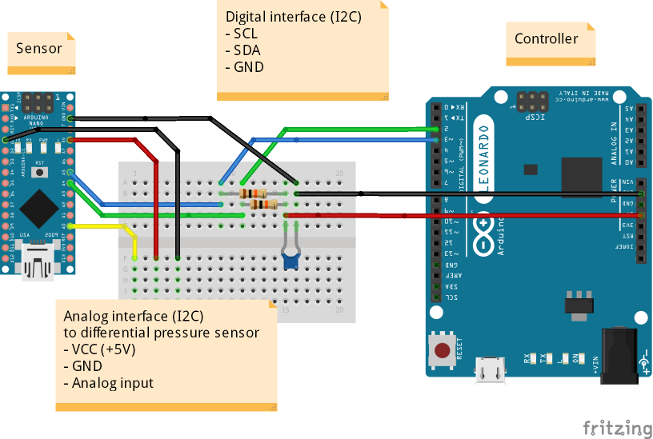

  

# DIY-Beatmungsgerät Mass Air Flow Sensor

The mass air flow sensor has started as part of the "DIY-Beatmungsgerät" project, which itself developed itself from the German hackathon event [#WirvsVirusHackathon](https://wirvsvirushackathon.org/) in March 2020.

The aim of this repository to provide data to use ready-made mass air flow sensors as well as build and verify DIY mass air flow sensors. The current DIY approach is based on analogue differential pressure sensors.

## Hardware setup

The hardware setup consists of replaceable components:

- The sensor controller (e.g. an Arduiono Leonardo) which reads flow values from one or several meters.
- The mass airflow meter, either being
  - a ready-made meter, such as an *Sensirion SFM3000 Low Pressure Drop Digital Flow Meter* or
  - a DIY meter, consisting of a differential pressure sensor + 3D printed tube + hardware to read values from the sensor (e.g. an Arduino Nano) and provide them over a digital interface.

  

The digital interface between sensors/meters and sensor controller is a simple I2C interface, i.e. the signals SCL (serial clock), SDA (serial data) and a common GND is required. The two I2C lines should also have a pull-up resistor. In the setup shown above, the pull-up resistors are pulled up by the controller's VCC of 5 V.

The hardware setup is based on Arduino hardware, but in general other hardware with an I2C interface, a generic I2C library and a C++ compiler can theoretically be used, too.

## DIY mass air flow meter

Our prototype for a DIY mass air flow meter consists of:

1. **a 3D printed tube:**
   Currently two designs are available: the "Grid type" and the "Venturi type"); the model files are available within this repository.

2. **an analog differential pressure sensor:**
   The current prototype uses a NXP MPXV5004DP (for 0 to 3.92 kPa). It's an 8-pin chip but uses only power supply (VCC + GND) and provides a measurement via its analog output V_OUT. The 3D models of the tube are designed to fit the sensor in middle of the tube.

3.  **a microcontroller board** used to sample the analog values and provide them via a compatible digital interface (I2C):

   The prototype is based on an Arduino Nano. 

  

